# SimplyFit

## Overview
SimplyFit is an iOS mobile fitness application designed to help users manage their health and fitness goals in one convenient place. The app makes it easy for users to track calories, workouts, weight, progress, and personal goals while keeping the experience simple and beginner-friendly.

SimplyFit is built to help users better understand their fitness journey by giving them a clear place to log activity, view history, and stay consistent with their routine.

SmplyFit is a personal fitness companion that helps users track their daily workouts, monitor nutrition, connect with friends, and get personalized guidance from an AI coach. Built natively for iPhone using SwiftUI with a Supabase backend for real-time data sync, authentication, and cloud storage.

---

## Tech Stack

- **SwiftUI** — native iOS UI
- **Supabase** — authentication, PostgreSQL database, row-level security
- **Anthropic Claude API** — AI fitness coach
- **USDA FoodData API** — food search and nutrition data
- **UserDefaults** — local caching for offline support

---

## Features at a Glance

| Feature | Description |
|---|---|
| Auth | Email sign up / sign in with password validation |
| Dashboard | Daily check-in, weekly rings, calorie & water tracking |
| Activity Log | Permanent & one-time exercise tracking with history |
| Nutrition | Food search, macro tracking, calorie ring |
| Calendar | Year-view with 3-ring activity indicators per day |
| Social | Friends, challenges, communities, direct messaging |
| AI Coach | Claude-powered fitness chat with user context |
| Achievements | 40+ unlockable badges across multiple categories |
| Settings | Profile, targets, themes, notifications |

---

## Screenshots

### Sign Up
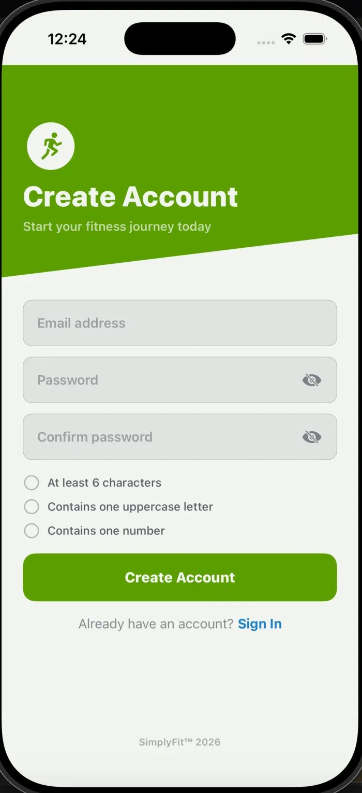

The onboarding screen lets new users create an account with email and password. Real-time password validation checks for minimum length, an uppercase letter, and a number before enabling the Create Account button. Existing users can jump straight to sign in.

---

### Dashboard
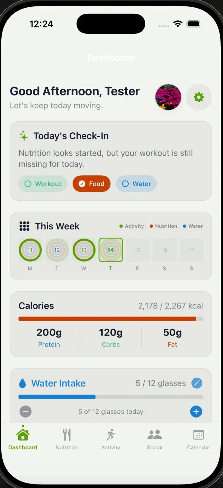

The main home screen greets users by name and gives an at-a-glance summary of the day. The **Today's Check-In** card shows whether workouts, food, and water have been logged. The **This Week** widget displays the current week as 7 daily rings — green for activity, orange for nutrition, blue for water — so users can spot gaps at a glance. Below that, the calorie card shows consumed vs. goal with a macro breakdown, and the water intake card lets users log glasses directly from the dashboard.

---

### Activity Log
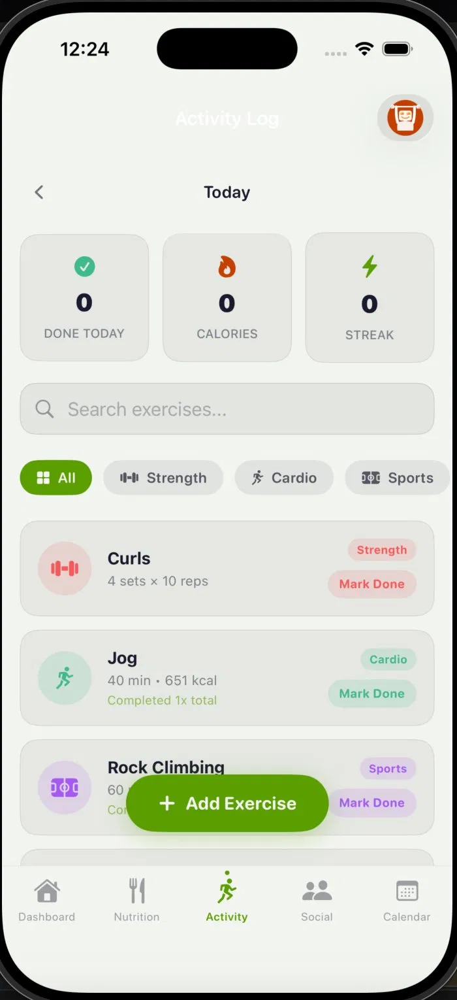

The activity log is a persistent exercise library — exercises are created once and appear every day to be marked done. Users can filter by category (Strength, Cardio, Sports, Flexibility, Outdoor), search by name, and navigate back through history using the arrow controls at the top. Past days are read-only and show only completed exercises. New exercises can be saved permanently or logged as a one-time entry. A built-in calorie calculator supports all 5 exercise categories using MET-based formulas. The AI coach button (top right) opens a contextual fitness chat.

---

### Nutrition
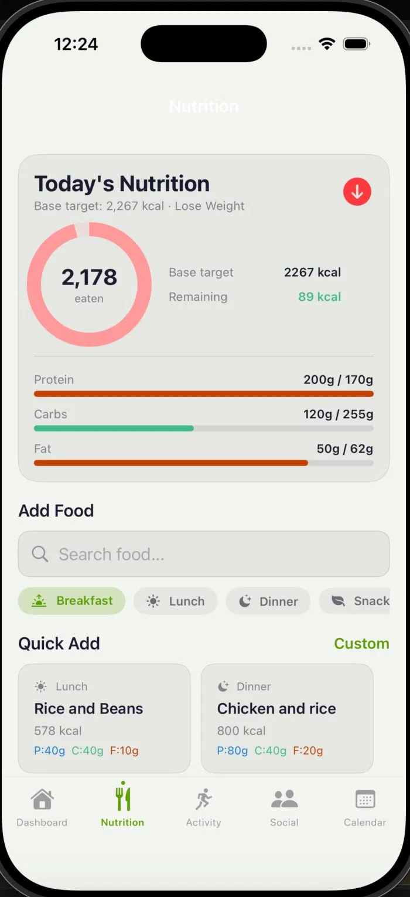

The nutrition screen tracks daily calorie and macro intake. The summary card shows a circular progress ring that changes color and laps when the calorie goal is exceeded. Macro bars for protein, carbs, and fat show progress against personalized targets. Users can search the USDA food database, use quick-add cards for common meals, or enter a fully custom food entry. Logged foods are grouped by meal type — Breakfast, Lunch, Dinner, Snack, and Drink.

---

### Calendar
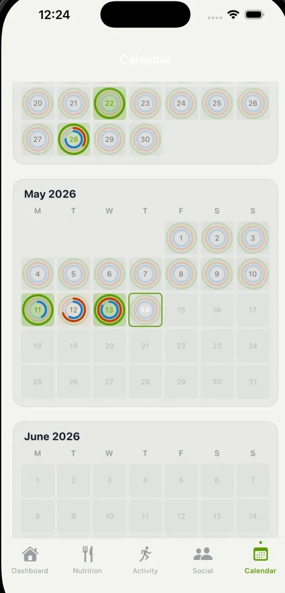

The full-year calendar gives a visual history of every day in 2026. Each day cell shows three concentric rings — the outer lime ring fills when a workout was completed, the middle orange ring reflects nutrition progress, and the inner blue ring shows water intake. Today is highlighted with a green border. Tapping any past day opens a detailed breakdown of workouts logged, calories eaten, and water consumed for that day. The calendar auto-scrolls to today when opened.

---

### AI Fitness Coach
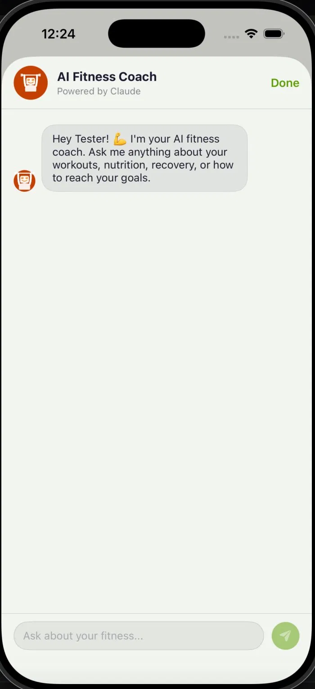

The AI coach is powered by Claude and accessible from the Activity Log. It automatically receives context about the user's goal, weight, streak, calorie target, and recent completed workouts before every conversation. Users can ask about workout advice, nutrition guidance, recovery tips, or motivation. Suggestion chips appear on first open to help users get started quickly.

---

### Achievements
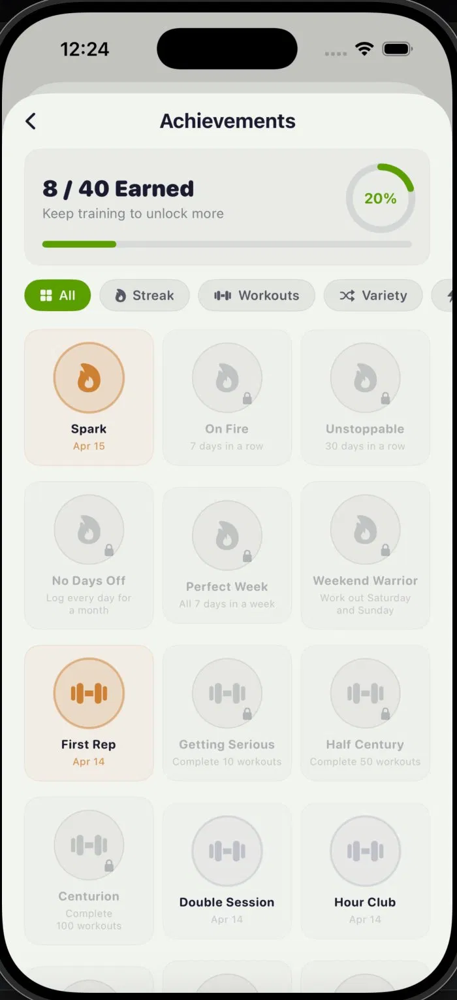

The achievements screen tracks progress across 40+ unlockable badges organized into categories — Streak, Workouts, Variety, Calories, Water, and more. Earned achievements display the unlock date in green. Locked badges show their requirements so users know what to work toward. A progress ring and bar at the top show overall completion percentage. Achievements are evaluated automatically in the background as the user logs activity.

---

### Profile
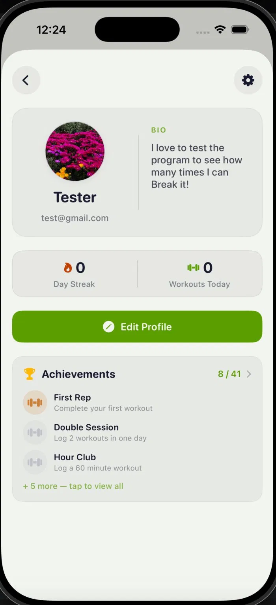

The profile screen shows the user's photo, bio, current day streak, and today's workout count. An achievements preview card shows recently earned badges with a tap-to-expand option to view all 40+. The Edit Profile button opens settings where physical stats and goals can be updated.

---

### Settings
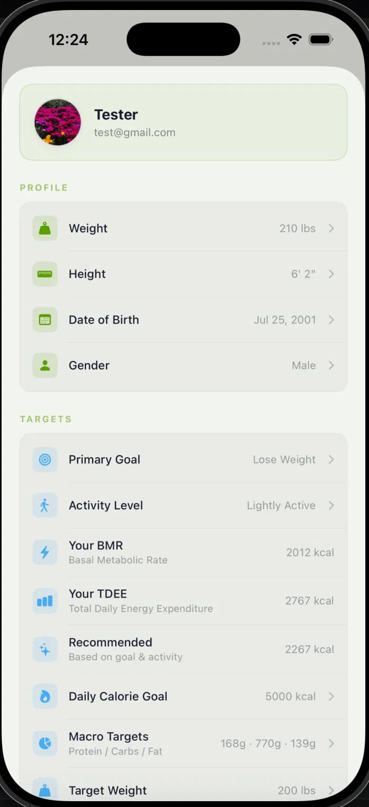

Settings is organized into sections — Profile (weight, height, date of birth, gender), Targets (goal, activity level, BMR, TDEE, calorie goal, macros, target weight), Display (theme picker with Dark, Light, and Vibrant options), Notifications (meal, workout, and streak reminders with time controls), and Account (password change, log out). Changes are saved to Supabase and synced across devices. An Admin Panel section appears for admin users.

---

### Social — Friends
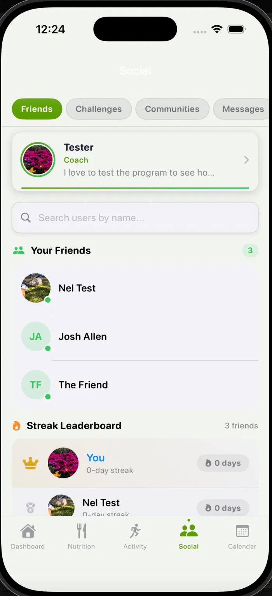

The Friends tab shows the user's friend list with online status indicators. A streak leaderboard ranks friends by their current workout streak. Users can search for other users by name to add them as friends. A coach card at the top highlights featured profiles.

---

### Social — Challenges
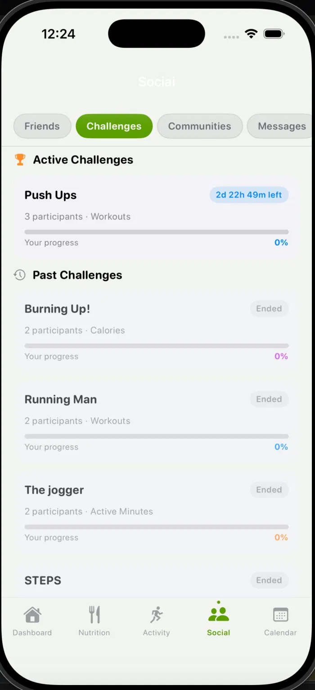

The Challenges tab lets users compete with friends on workout-based goals. Active challenges show a live countdown timer and participant count. Each challenge tracks the user's individual progress as a percentage. Past challenges are archived with their final status. Challenge types include Workouts, Calories, and Active Minutes.

---

### Social — Communities
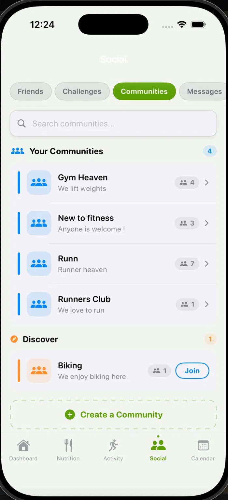

Communities are group spaces users can join or create around shared fitness interests. Each community shows its member count. A Discover section surfaces communities the user hasn't joined yet with a one-tap Join button. Users can create their own community with a custom name and description.

---

### Social — Messages
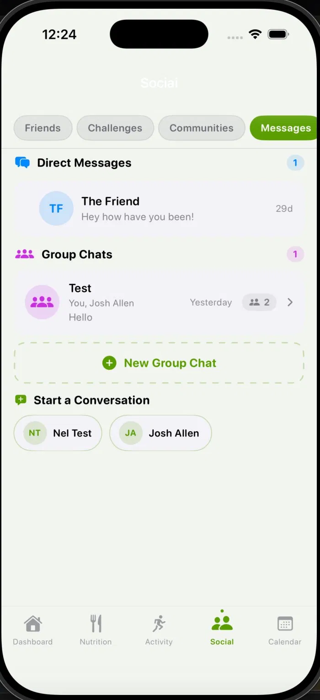

The Messages tab supports both direct messages and group chats. The conversation list shows the last message and timestamp for each thread. Users can start a new DM from a list of their friends or create a group chat with multiple participants.

---

## Architecture

```
SmplyFit/
├── Views/
│   ├── ContentView.swift         # Color extensions + auth entry
│   ├── RootView.swift            # App root + theme injection
│   ├── MainTabView.swift         # Tab bar navigation
│   ├── DashboardView.swift       # Home screen
│   ├── ActivityLogView.swift     # Exercise tracking + AI coach
│   ├── NutritionView.swift       # Food logging
│   ├── CalendarView.swift        # Year calendar
│   ├── ProfileView.swift         # User profile
│   ├── SettingsView.swift        # Settings
│   ├── AchievementsView.swift    # Badge system
│   ├── adminPanelView.swift      # Admin tools
│   └── Social Views/             # Friends, challenges, communities, messages
├── Services/
│   ├── WorkoutService.swift      # Supabase workout CRUD
│   ├── DailyLogService.swift     # Daily log sync
│   ├── ProfileService.swift      # Profile management
│   ├── AchievementService.swift  # Badge evaluation
│   └── WeightLogService.swift    # Weight history
├── Managers/
│   ├── NutritionManager.swift    # Calorie + macro state
│   ├── ThemeManager.swift        # App-wide theming
│   └── NotificationManager.swift # Local notifications
└── Models/
    ├── ActivityEntry.swift       # Exercise model
    ├── User.swift                # User model
    └── ...
```

---

## Context Diagram

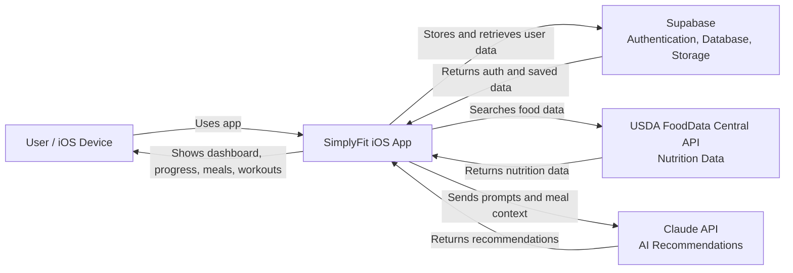

---


## Database (Supabase)

| Table | Purpose |
|---|---|
| `profiles` | User info, physical stats, weight history, settings |
| `workouts` | Exercise library with per-day completion tracking via `completed_dates` |
| `daily_logs` | Water consumed, calorie intake, calories burned, and workout count per day |
| `food_logs` | Individual food entries logged by users |
| `custom_foods` | User-created food entries with custom macro values |
| `user_achievements` | Unlocked badge records with timestamps |
| `challenges` | Competitive fitness goals created between users |
| `challenge_participants` | Tracks each user's progress and participation in challenges |
| `communities` | Group spaces users can create or join |
| `community_members` | Membership records linking users to communities |
| `community_messages` | Messages posted inside community group spaces |
| `direct_messages` | One-on-one messages between friends |
| `group_chats` | Group chat rooms with multiple participants |
| `group_chat_members` | Membership records for group chat rooms |
| `group_chat_messages` | Messages sent inside group chats |
| `blocks` | Records of users blocking other users |
| `reports` | User-submitted reports for moderation |

All tables use Row Level Security (RLS) so users can only read and write their own data.

---

## Setup

1. Clone the repo
2. Open `SmplyFit.xcodeproj` in Xcode
3. Add your keys to the project (not committed):
   - `ANTHROPIC_API_KEY` — for the AI coach
   - Supabase URL and anon key — in your Supabase config file
4. Run the SQL migrations in `/supabase/migrations` against your Supabase project
5. Build and run on a physical device or simulator (iOS 17+)

---


## Demo
- Development Phase: Active
- Platform: iOS Mobile Application
- Repository: GitHub Version Controlled

---

## Key Features
- User registration and login
- Profile management
- Calendar view for tracking activity
- Dashboard with progress summaries
- Calorie tracker and food lookup
- Workout search and workout tracking
- Direct messaging
- Community and group chat
- Profile achievements and goals
- Weight progress graph
- Multiple color theme options
- Automatic calorie calculator based on user information such as weight, height, age, and goals

---

## User Stories
1. As a user, I want to create an account and log in so I can securely use the app. (Carlos, Yohangel)
2. As a user, I want my data saved so I can see my progress on any device. (Carlos, Nelson)
3. As a user, I want to be able to save my excercises and mark them as completed daily. (Carlos)
4. As a user, I want to track my calories so I can manage my diet and health goals. (Carlos, Nelson, Shanzay, Sammuel)
5. As a user, I want to search for workouts using AI so I can find exercises that match my fitness goals. (Carlos)
6. As a user, I want to view my weight history and charts so I can understand my progress visually. (Carlos, Shanzay Nelson)
7. As a user, I want to communicate with other users so I can stay motivated and connected. (Nelson)
8. As a user, I want to be able to look at a calendar and see my past days progress. (Carlos, Nelson)
9. As a user, I want an easy-to-use interface so I can navigate the app without confusion. (Carlos, Shanzay, Nelson)
10. As a user, I want to have a profile where I can change my photo and bio.  (Yohangel)
11. As a user, I want to earn badges to keep me going.  (Carlos, Shanzay)
12. As a user, I want different themes to specialize my app. (Carlos)
13. As a user, I want to be able to log my water intake customize how much i should drink.  (Carlos, Nelson)
14. As a user, I want to be able to setup notifications to remind myself to eat, drink, and workout. (Sammuel)
15. As a user, I want to add temporary excercises that won't save forever but just for one day.  (Carlos)
16. As a user, I want to be able to block or remove friends or users on the platform. (Nelson) 
17. As a user, I want to be able to set my fitness goals and have recomended calories change depending on my choice.(Carlos, Nelson)
18. As a user, I want to be able to search through a USDA food database to find the food i'm eating. (Nelson)
19. As a user, I want to devlop a streak so I am encouraged to keep using the app.  (Carlos, Nelson)
20. As a user, I may not know the calories burned for my excercises and want a option to calculate them for myself. (Carlos)

---

## Technologies Used
- Swift
- Xcode
- Supabase
- GitHub
- iOS Development Tools
- Workout and Food Lookup Integration
- Agile Development Practices

---

## Project Architecture
The application follows a modular structure consisting of the following layers:

- User Interface Layer – Handles user interaction and screen navigation
- Application Logic Layer – Processes calorie calculations, workout tracking, and app features
- API Integration Layer – Retrieves workout and food-related data from external sources
- Data Layer – Stores user accounts, goals, progress, and activity history

---

## System Access and Testing
To test the system, download the project from the GitHub repository and open it in the latest version of Xcode on a Mac. The app can be run on the iOS simulator or on a physical iPhone connected by USB with Developer Mode enabled.

The application does not require the App Store for testing because it is run directly through Xcode. Any required user accounts, passwords, or test credentials should be included in the final documentation package if applicable.

---

## Development Process
This project follows an Agile development approach with ongoing planning, implementation, and testing.

---

## Challenges and Solutions
**Challenge:** Learning a new programming language and development framework.

**Solution:** The team worked together through practice, collaboration, and resource sharing to improve speed, understanding, and development quality.

---

## Team Members
- Samuel Jean
- Nelson Mojica
- Shanzay Noor
- Yohangel Adames
- Carlos Berio

---

## Project Status
**Current Phase:** Active Development

SimplyFit is still being improved with new features, refinements, and testing.

---

## Why This Project Matters
This project demonstrates:
- Mobile application development skills
- API integration
- Team collaboration using GitHub
- Software engineering best practices
- Real-world problem solving


---

## Test Account
Email : nel@gmail.com   
Password : Password

---

## Repository
GitHub: https://github.com/Kinglos01/FitnessApp
